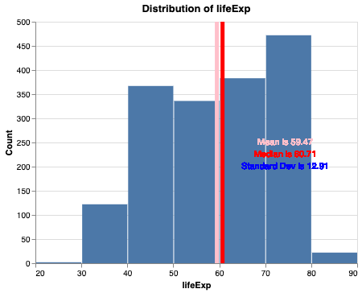
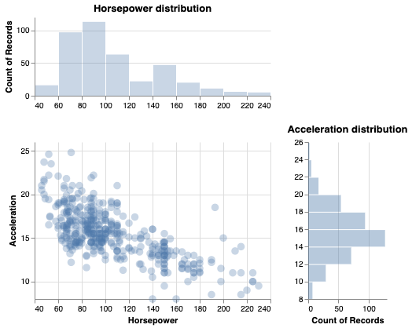
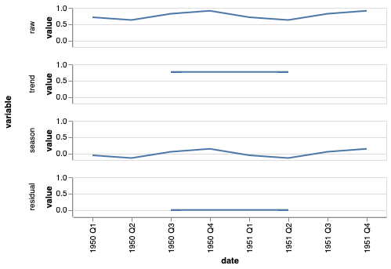
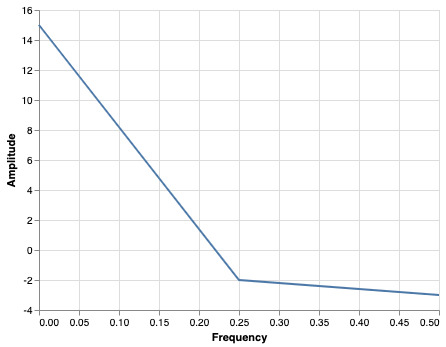

## altairexpress   

 [](https://codecov.io/gh/UBC-MDS/altairexpress) 

[](https://altairs.readthedocs.io/en/latest/?badge=latest)

Python package that creates basic EDA graphics in Altair with ease. It allows users to quickly create plots to facilitate exploratory data analysis along with providing additional summary statistics about the data such as mean, median, and correlation.

### Installation:

```
pip install -i https://test.pypi.org/simple/ altairexpress
```
### Package Developers
- Jack Tan

- [Lesley Miller](https://github.com/aromatic-toast)

- [Tejas Phaterpekar](https://github.com/tejasph)

- Wenjiao Zou


### Summary Overview
-  This package simplifies the process of conducting Exploratory Data Analysis (EDA) on new datasets. It is designed to allow the user to explore the data graphically as well as obtain some basic summary statistics, all by writing only one line of code. Plots are produced using the `Altair` package under the hood. As Jenny Bryan once said: “Someone has to write for-loops, but it doesn’t have to be you!”. This sentiment has been implemented here for EDA analysis. The user is able to spend more time on analyzing the dataset and less time on configuring complex Altair plot settings.

### Features
- **Fast Fourier transforms:** This function is missing from many summary functions and can be really useful for some cases. The user will be able to input time series data and the function will automatically implement frequency analysis and provide a frequency vs amplitude plot.

- **Scatter plot:** Here you will take your own spin on 2-d scatter plots. It is often the case that we don’t know the distribution of the given points. This is why this function will group the points by each of the x and y axes and provide two histograms alongside the scatter plot. This way, you will have greater intuition on the properties of the data.

- **Histogram:** This function takes in a dataframe and column name and creates a histogram. In addition, summary statistics of the input variable are overlayed onto the plot (e.g. mean and median vertical lines) and the sample standard deviation.


- **Time series analysis:** This is a function that takes in a local path to the time series data, decomposes the timeseries and finally visualizes the raw data along with decomposition components. Except annual time series, the function will return a graph with 4 subplots, which includes the raw data, estimated trend, seasonal/cyclic and noise components.


### Dependencies
- [Pandas > v3.7](https://pandas.pydata.org/)
- [Altair > v3.3.0](https://altair-viz.github.io)
- [Numpy > v1.18.1)](https://numpy.org)

### How the package fits into the Python ecosytem

- Although what our package does is by no means ‘new’ from a technical perspective (we are relying on already built packages to do everything), it does provide convenience to the user. There are many more universal summary packages out there, such as [pandas.DataFrame.describe()](https://pandas.pydata.org/pandas-docs/stable/reference/api/pandas.DataFrame.describe.html) for python and [summary](https://www.rdocumentation.org/packages/base/versions/3.6.2/topics/summary) for R), our package is able to combine both analysis and visual representation of the data for specific (FFT) and general (bar chart) tasks.

### Documentation
The official documentation is hosted on Read the Docs: <https://altairs.readthedocs.io/en/latest/?badge=latest>

[Test PyPI Link](https://test.pypi.org/project/altairexpress/)


# Package Walk-Through 
When conducting Exploratory Data Analysis it is useful to plot the variables in the data to get an intial sense of the distribution and potential behaviour of the data. If the dataset contains many variables creating separate plots for each one could become tedious. This package automates the plot configuration process and generates basic graphics that summarize the data. 

This package contains 4 functions; two for general purpose exploratory tasks and two that are more specific. 

Creates a basic histogram that indicates the position of the mean and median and displays the standard deviation.

- `gghist`

Creates a scatterplot and calculates the correlation coefficient. 

- `ggscatter`

Creates a Fourier transform plot.

- `fourier_transform`

Converts time series data into 4 subplots displaying the raw data, trend, seasonal and noise components. 

- `ts_plot`


## To demo the pacakge functions, simply install the package and copy and paste these commands into jupyter lab to render the plots. 


### **Obtain a histogram and basic summary statistics with gghist()**

This plot displays the position of the mean and median of life expectancy from the gapminder dataset. In addition, the plot also displays the value of the mean, median and standard deviation. 
```
from gapminder import gapminder
from altairexpress.hist import hist

hist(gapminder, "lifeExp")
```


### **Obtain a scatterplot with make_scatter()**

The `make_scatter()` returns a basic scatterplot but also returns the correlation coefficient between the Horsepower and Acceleration of cars. 

```
from altairexpress.scatter import make_scatter
from vega_datasets import data

make_scatter(data.cars(),
    xval = "Horsepower", 
    yval = "Acceleration")
```


### Time Series Decomposition with ts_plot()
This function is able to take in a time stamped dataframe and convert it into a time series object. The time series is then decomposed into its trend, seasonsal and white noise components.

```
from altairexpress.ts import ts
import pandas as pd
time = ["1950 Q1", "1950 Q2", "1950 Q3", "1950 Q4",
"1951 Q1", "1951 Q2", "1951 Q3", "1951 Q4"]
earnings = [0.71, 0.63, 0.82, 0.91,
0.71, 0.63, 0.82, 0.91]
ts_data = pd.DataFrame({"time" : time, "earnings" : earnings})
ts_alt(ts_data, "earnings", 4)
```


### Fourier Transform with fourier_transform()
The plow below displays a simple fourier transform with some simple sample data. 

```
from altairexpress.fourier_transform import fourier_transform
my_data = pd.DataFrame(data = {'time_series':0,1,2,3],'signal': [2,3,4,6]})

fourier_transform(data=my_data, time_col='time_series',data_col='signal')
```


### Credits
This package was created with Cookiecutter and the UBC-MDS/cookiecutter-ubc-mds project template, modified from the [pyOpenSci/cookiecutter-pyopensci](https://github.com/pyOpenSci/cookiecutter-pyopensci) project template and the [audreyr/cookiecutter-pypackage](https://github.com/audreyr/cookiecutter-pypackage).
